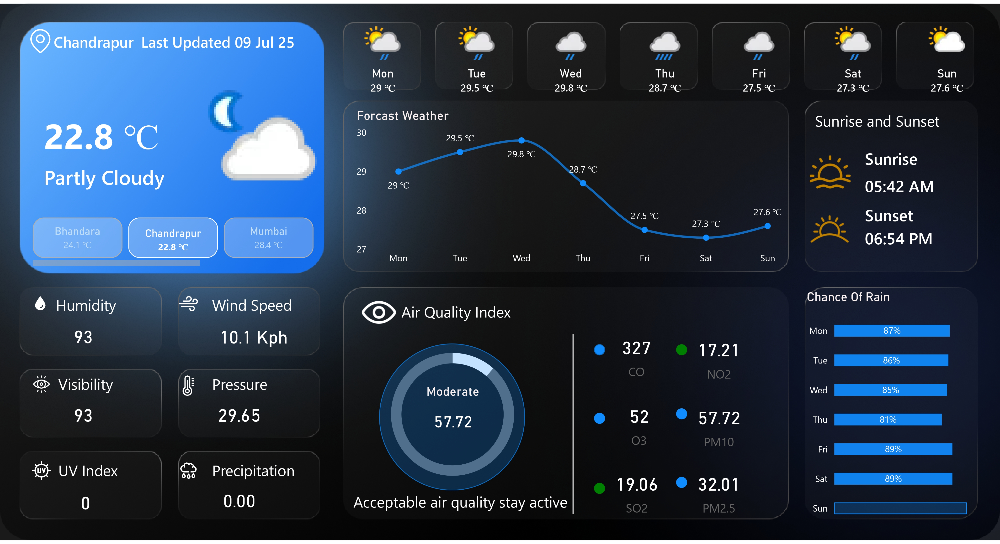

# 🌤️ Power BI Weather Forecast Dashboard

This repository contains a Power BI project that visualizes real-time weather conditions and 7-day forecasts for 5 Indian cities using data from a weather API.

## 📊 Dashboard Overview

- Current weather stats (Temp, Humidity, Wind, UV Index, etc.)
- 7-day forecast line chart
- Air Quality Index with pollutant breakdown
- Visual design using cards and modern UI in Power BI

### 📌 Cities Covered

- Chandrapur
- Bhandara
- Mumbai
- Nagpur
- Pune

### 🖼️ Preview



## 🔌 Data Source

- **API Used:** [WeatherAPI](https://www.weatherapi.com//)
- Data was fetched using Power BI Web connector or Python/Power Query script
- Live and historical weather data processed for visualizations

## 🛠️ Tools Used

- Power BI Desktop (.pbix)
- Weather API
- DAX & Power Query
- Custom visuals 

## 📁 Project Structure

- `Dashboard/Weather_Dashboard.pbix` – Main Power BI report file
- `assets/` – Screenshots and charts used in documentation
  

## 🚀 How to Use

1. Clone the repo
   ```bash
   git clone https://github.com/your-username/weather-dashboard-powerbi.git
